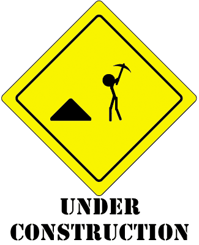

# This repo is under construction

 

      
  

## Todo 
- make single json file for each day
- serve json on requests
- build a UI using react

# ethPrices
Get Eth prices from multiple source and expose result from a rest end point.
This a no DB software where will get data and save as a json file, later will server these file to requesters

### CREDIT
- [Coin Gecko](https://www.coingecko.com/) - API for eth prices
- [Binance](https://www.binance.com/) - API for eth prices 

